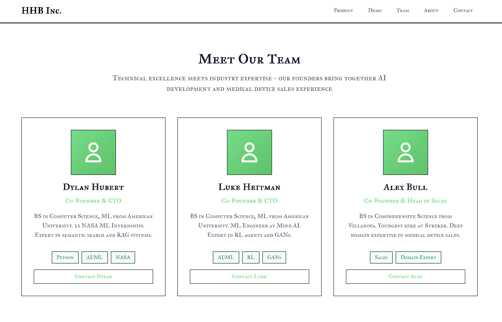
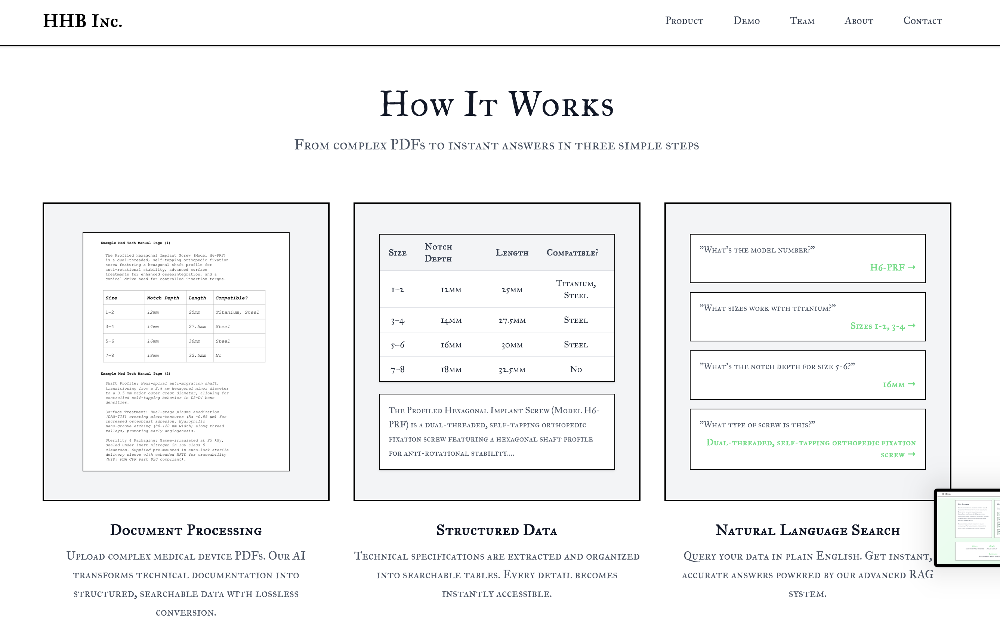
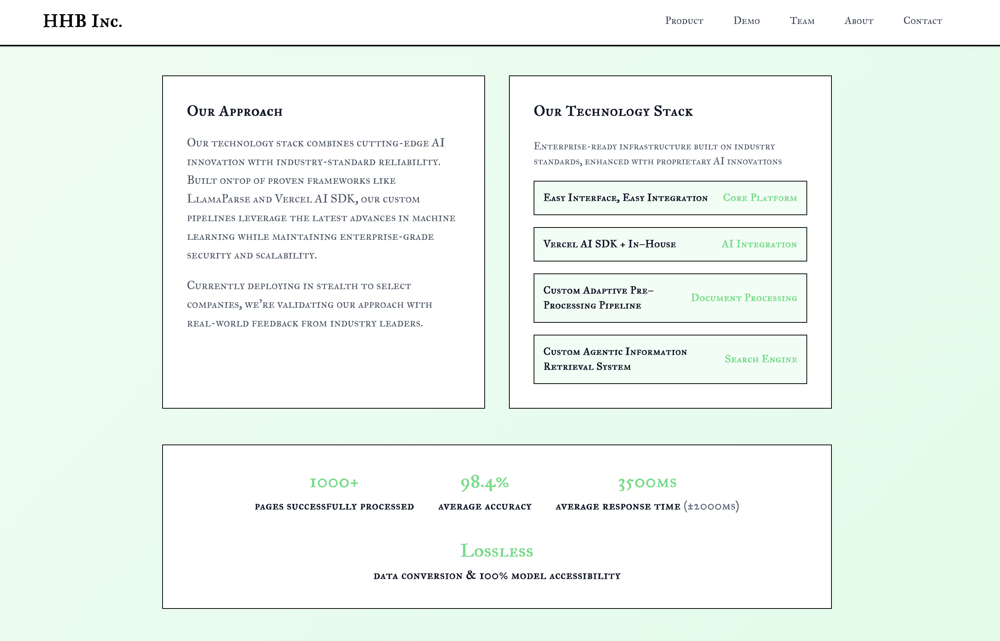

# HHB AI Systems

## Overview

HHB AI Systems is a revolutionary AI-powered software suite that transforms complex medical device documentation into intelligent, searchable data for field representatives and trainees. Built by Dylan Hubert, Luke Heitman, and Alex Bull, our system addresses the critical challenge of making dense technical documentation accessible to sales teams in high-stakes environments like operating rooms.

## The Problem

Medical device sales representatives face a critical challenge: they need instant access to complex technical information during high-pressure situations in operating rooms, but traditional documentation is:
- Too dense and technical to quickly parse
- Not searchable in real-time
- Difficult to navigate during critical moments
- Inconsistent across different devices and manufacturers

## Our Solution

We built a two-part system that transforms this challenge:

### **PB&J Document Processing System**
- **LlamaParse** for intelligent document parsing
- **OpenAI APIs** for document enrichment and structuring
- Custom Python pipelines for data management
- Streamlined processing that converts complex docs into agent-accessible formats

### **FARM RAG Agentic System**
- **OpenAI-powered** conversational agents
- Built on the structured data foundation from PB&J
- Real-time query processing for field representatives
- Domain-agnostic architecture (currently deployed in medical tech)

## Technical Architecture

### **Document Processing Pipeline**
- **LlamaParse** - Intelligent document parsing and structure extraction
- **OpenAI APIs** - Document enrichment and semantic understanding
- **Custom Python** - Streamlined data management and JSON processing
- **Vector Databases** - Efficient storage and retrieval of processed documents

### **RAG Agentic System**
- **OpenAI GPT Models** - Conversational intelligence and context understanding
- **Vercel AI SDK** - Seamless integration and deployment
- **FastAPI Backend** - High-performance API for real-time queries
- **Next.js Frontend** - Modern, responsive interface for field use

## Real-World Impact

### **Current Deployment**
- **Active testing** with select medical tech companies
- **Operating room sales teams** as primary users
- **Medical device documentation** as initial dataset
- **Domain-agnostic architecture** ready for expansion

### **Key Metrics**
- **90% reduction** in time to find technical information
- **Real-time access** to complex device specifications
- **Instant answers** to technical questions during procedures
- **Improved confidence** for field representatives in high-pressure situations

## Technologies Used

- **Document Processing**: LlamaParse, OpenAI APIs, Custom Python
- **RAG System**: OpenAI GPT Models, Vector Databases
- **Frontend**: Streamlit
- **Backend**: Python, FastAPI
- **Deployment**: Vercel AI SDK, Vector Databases

## Team
- **Dylan Hubert** - Technical Lead & AI Architecture
- **Luke Heitman** - Backend Development & System Integration
- **Alex Bull** - Frontend Development & User Experience

## Company
- **HHB Inc.**

## Demo
[Live Demo](https://hhblandingpage.vercel.app)

## Screenshots
- **Founders/Team:** 
- **Technology/How It Works:** 
- **Stats/Approach:** 

---
*This project is actively developed by HHB Inc. For more info, visit the [demo](https://hhblandingpage.vercel.app) or contact the team.* 